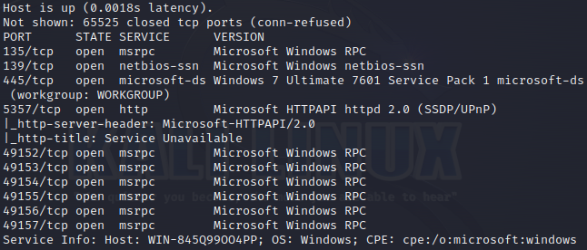

# Blue VM Penetration Testing Walkthrough
## Reconnaissance and Scanning
1. Device scanning\
   `nmap -sn <network address>`\
Note: how do we know the target if there is a lot of other active addresses?

2. Target port scanning\
   `nmap -p- -A -T4 <target ip address>`\
Result: detects all open ports, services, version, OS discovery and informations\

Ports to  look out: 20, 21, 22, 23, 25, 80, 137, 139, 443, 445 (FTP, SSH, Telnet, SMTP, NetBIOS, SMB, HTTP, HTTPS)

At this step, get more understanding from the result by searching online and identify possible vulnerabilities from it.

- msrpc: endpoint mapper. Communication framework by many windows component
- netbios-ssn: a protocol to connect two computers to transmit heavy data traffic
- windows-ds: Windows network for sharing sources

There's a lot of additional information on smb too. Try to look for any possible exploit on the smb service version.
Get:\
- [MS Windows 7 build 7601 - Privilege Escalation (Exploit Database)](https://www.exploit-db.com/exploits/47176)
- [MS17-010 EternalBlue SMB Remote Windows Kernel Pool Corruption (Rapid7)](https://www.rapid7.com/db/modules/exploit/windows/smb/ms17_010_eternalblue/)

## Exploitation
1. Try to look for possible exploitation (to gain access) in metasploit\
- `auxiliary` is more towards scanning than exploitation
- `exploit` is used for attack

Using metasploit:
- `msfconsole` -> running metasploit on console
- `search <keyword>` -> search for a tool related to something we want to do
- `use <number/name>` -> using that tool
- `options` -> module options such as setting target host
- `set <module name ex. RHOSTS>` -> set target host
- `run` -> running the tool
- `check` -> running an exploit tool that works like auxiliary tool
- `set payload <payload>` -> setting payload to be used in the exploitation activity. Can be used to check if there is another type of payload in a different device architecture

2. Dumping access credentials after successful exploitation\
image\

## Manual exploitation
1. Search for tool specified for the vulnerability online (look especially for github repo)
2. Clone it locally and run it\
Get: [MS17-010 Exploit Code](https://github.com/3ndG4me/AutoBlue-MS17-010)

Without meterpreter, it will open a listener on the target machine so that we can do whatever we want from our own device.

! Be careful when running exploitation in real situation as it may take down the machine

Then, we have credentials that can be used to get into the internal environment from metasploit hashdump and we are able to take down a machine from the github tool.
